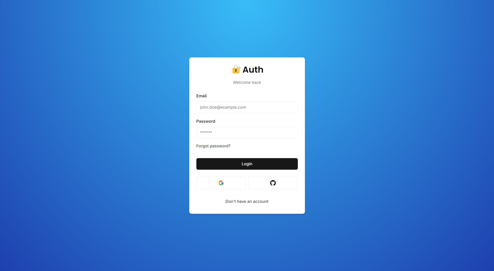

<div align="center">
  <p align="center"></p>
  <h1 style="border: none;">Next Auth V5</h1>
  <div>
    
    
    
    
    
    
  </div>
</div>

## 📋 <a name="table">Table of Contents</a>

1. 🤖 [Introduction](#introduction)
2. ⚙️ [Tech Stack](#tech-stack)
3. 🔋 [Features](#features)
4. 🤸 [Quick Start](#quick-start)

## <a name="introduction">🤖 Introduction</a>

Implement advanced authentication in your Next.js application using NextAuth v5. This project integrates robust and secure authentication features, enabling seamless user management with options like OAuth providers, email verification, and more.
<br /><br />


## <a name="tech-stack">⚙️ Tech Stack</a>

- Next.js
- TypeScript
- Prisma
- Shadcn
- TailwindCSS
- Neon.tech
- NextAuth v5 (Auth.js)

## <a name="features">🔋 Features</a>

👉 **Advanced Tools and Functionalities**:
- NextAuth v5 (Auth.js) integration.
- Support for OAuth providers (Google & GitHub).
- Credentials provider for traditional email/password login.
- Email verification for secure sign-ups.
- Forgot password functionality.
- Two-factor authentication (2FA).
- Role-based access control with admin and user roles.
- Login and registration components with options for modal or redirect.
- Secure API routes with role-based protection.

## <a name="quick-start">🤸 Quick Start</a>

Follow these steps to set up the project locally on your machine.

**Prerequisites**

Make sure you have the following installed on your machine:

- [Git](https://git-scm.com/)
- [Node.js](https://nodejs.org/en)
- [npm](https://www.npmjs.com/) (Node Package Manager)

**Cloning the Repository**

```bash
git clone https://github.com/Firkhie/next-auth-v5.git
cd next-auth-v5
```

**Package Installation**

Install the project dependencies using npm:

```bash
npm i
```

**Set Up Environment Variables**

Create a new file named `.env` in the root of your project and add the following content:

```env
DATABASE_URL=

GITHUB_CLIENT_ID=
GITHUB_CLIENT_SECRET=

GOOGLE_CLIENT_ID=
GOOGLE_CLIENT_SECRET=

RESEND_API_KEY=

AUTH_SECRET=
```

Replace the placeholder values with your actual respective account credentials.

**Setup Prisma**

Add PostgreSQL Database (I used Neon.tech)

```bash
npx prisma db push
```

**Running the Project**

```bash
npm run dev
```

Open [http://localhost:3000](http://localhost:3000) in your browser to view the project.

#
